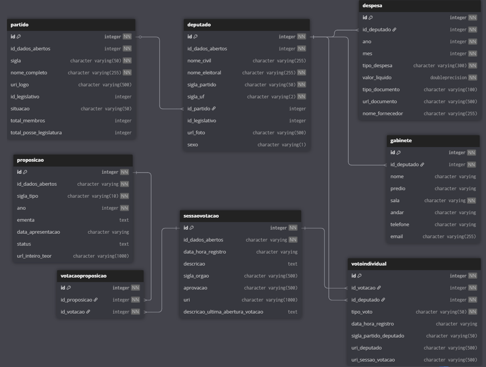
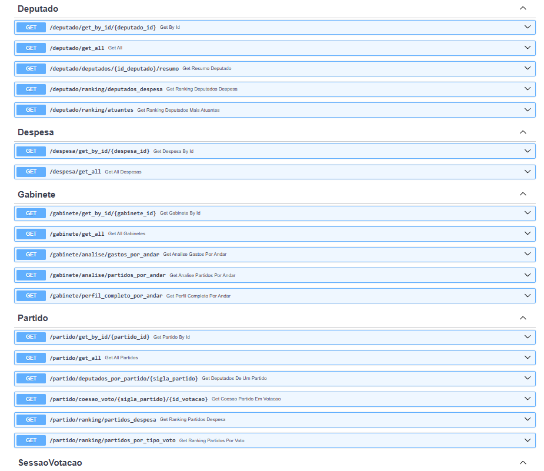
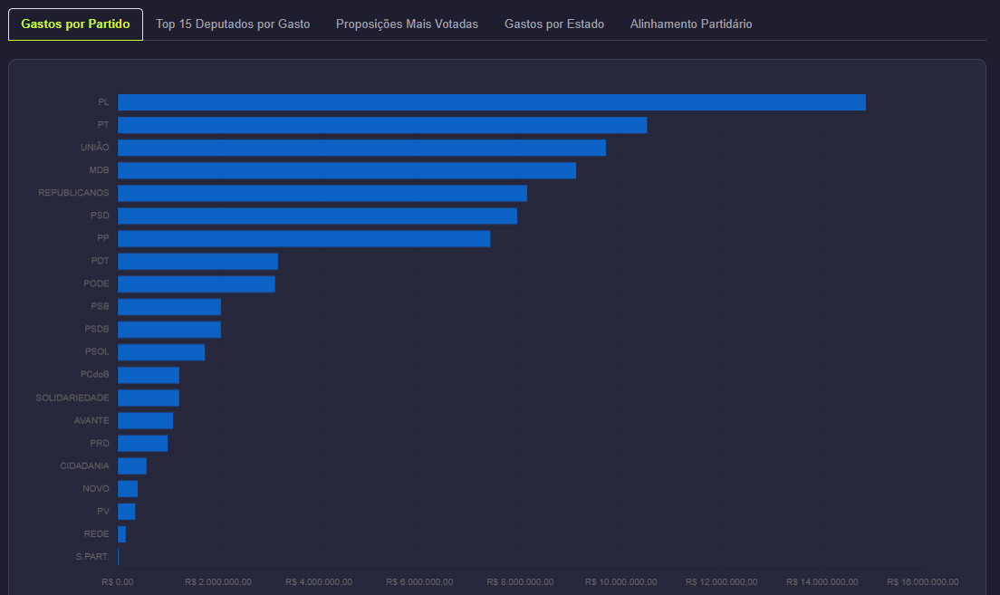
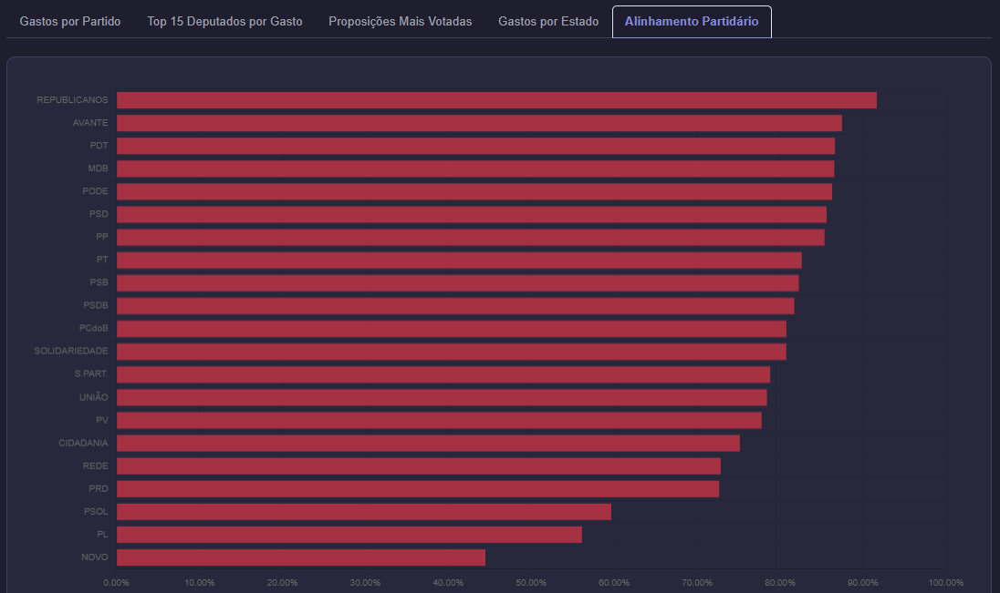

# Análise Parlamentar - Câmara dos Deputados (2024)

**Promovendo a transparência no legislativo brasileiro.**

Este projeto oferece uma API robusta e um backend analítico para extrair, processar e servir dados complexos da Câmara dos Deputados, com foco especial nas atividades do ano de 2024. Nossa missão é transformar dados brutos e de difícil acesso em insights claros e compreensíveis para qualquer cidadão.

## 📜 Índice

1.  [**Objetivos do Projeto**](#objetivos-do-projeto)
2.  [**Entendendo a CEAP (Cota Parlamentar)**](#-entendendo-a-ceap-cota-parlamentar)
3.  [**Salário e Outros Benefícios**](#-salario-e-outros-benefícios)
4.  [**Tecnologias Utilizadas**](#-tecnologias-utilizadas)
5.  [**Estrutura do Banco de Dados**](#-estrutura-do-banco-de-dados)
6.  [**Exemplos de Endpoints da API**](#-exemplos-de-endpoints-da-api)
7.  [**Demonstração do Dashboard**](#-demonstração-do-dashboard)
8.  [**Fonte dos Dados**](#-fonte-dos-dados)

---

## 🎯 Objetivos do Projeto

  * **Extrair Informações Úteis:** Coletar e organizar dados públicos que deveriam ser de fácil acesso, mas que se encontram dispersos e em formatos complexos.
  * **Monitorar o Comportamento Parlamentar:** Fornecer ferramentas para analisar padrões de gastos, votações e alinhamento político.
  * **Facilitar o Acesso:** Disponibilizar os dados através de uma API bem documentada, permitindo que desenvolvedores, jornalistas e cidadãos criem suas próprias análises.

-----

## 💰 Entendendo a CEAP (Cota Parlamentar)

Um dos principais focos de análise do projeto são os gastos realizados através da **Cota para o Exercício da Atividade Parlamentar (CEAP)**, popularmente conhecida como "Cotão". O mecanismo funciona como um sistema de reembolso:

> 1.  **O Gasto:** O deputado federal realiza uma despesa para executar seu trabalho.
> 2.  **O Pagamento:** Ele paga por esse serviço com seus próprios recursos.
> 3.  **A Prestação de Contas:** Apresenta a nota fiscal à Câmara para comprovar o gasto.
> 4.  **O Reembolso:** A Câmara utiliza o dinheiro público da CEAP para reembolsar o valor ao parlamentar.

As principais categorias de despesas permitidas são:

  * Manutenção de escritórios de apoio nos estados.
  * Transporte, locomoção, passagens aéreas e combustíveis.
  * Comunicação, serviços postais e assinaturas.
  * Divulgação da atividade parlamentar.
  * Consultorias, assessorias e pesquisas.
  * Hospedagem, alimentação e segurança.

---

### 💼 Salário e Outros Benefícios

Além da Cota Parlamentar (CEAP), é importante entender a estrutura completa de remuneração de um Deputado Federal para uma análise contextualizada. Os principais benefícios, além da cota de despesas, são:

* **Salário Bruto:** **R$ 46.366,19**
* **Verba de Gabinete:** Cerca de **R$ 118.000 por mês** para contratar até 25 secretários parlamentares para auxiliar nos trabalhos em Brasília e nos estados.
* **Auxílio-Moradia ou Imóvel Funcional:** Direito a ocupar um apartamento funcional em Brasília ou, na falta deste, receber um auxílio de **R$ 4.253,00** mensais.
* **Ajuda de Custo ("Auxílio-Paletó"):** Um pagamento extra, equivalente a um salário, no **início e no final de cada mandato** de 4 anos.
* **Saúde e Previdência:** Acesso a um plano de saúde vitalício (com sistema de reembolso) e a um regime de aposentadoria especial (PSSC), com regras distintas do INSS geral.

-----

## 🛠️ Tecnologias Utilizadas

Este projeto foi construído com uma stack de tecnologias moderna e performática, garantindo escalabilidade e facilidade de manutenção.

| Tecnologia | Descrição |
| :--- | :--- |
| **Python** | Linguagem principal para o desenvolvimento do backend. |
| **FastAPI** | Framework web de alta performance para a construção da API. |
| **SQLModel** | Biblioteca que combina SQLAlchemy e Pydantic para interagir com o banco de dados de forma intuitiva e segura. |
| **PostgreSQL** | Sistema de gerenciamento de banco de dados relacional, robusto e confiável para armazenar os dados coletados. |
| **Chart.js** | Biblioteca utilizada no frontend de demonstração para criar gráficos interativos e visualmente agradáveis. |

-----

## 🗃️ Estrutura do Banco de Dados

Os dados coletados são organizados em um esquema relacional no PostgreSQL, projetado para otimizar as consultas analíticas e garantir a integridade dos dados.

-----

## 🔌 Exemplos de Endpoints da API

Nossa API oferece uma variedade de endpoints para análises complexas, permitindo que o frontend ou outras aplicações consumam dados já processados.

## 📊 Demonstração do Dashboard

Para ilustrar o potencial da API, foi desenvolvido um frontend de exemplo que consome os endpoints e apresenta os dados de forma visual.

-----

## 🌐 Fonte dos Dados

Todos os dados utilizados neste projeto são públicos e foram obtidos através do portal oficial de Dados Abertos da Câmara dos Deputados.

**Link:** [https://dadosabertos.camara.leg.br/](https://dadosabertos.camara.leg.br/)
